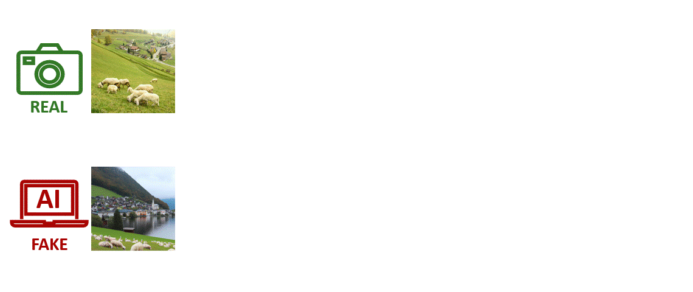

[](https://github.com/grip-unina/ZED/)
[](https://arxiv.org/abs/2409.15875)
[](https://www.grip.unina.it)

Detecting AI-generated images has become an extraordinarily difficult challenge as new generative architectures emerge on a daily basis with more and more capabilities and unprecedented realism. New versions of many commercial tools, such as DALLE, Midjourney, and Stable Diffusion, have been released recently, and it is impractical to continually update and retrain supervised forensic detectors to handle such a large variety of models. To address this challenge, we propose a zero-shot entropy-based detector (ZED) that neither needs AI-generated training data nor relies on knowledge of generative architectures to artificially synthesize their artifacts. Inspired by recent works on machine-generated text detection, our idea is to measure how surprising the image under analysis is compared to a model of real images. To this end, we rely on a lossless image encoder that estimates the probability distribution of each pixel given its context. To ensure computational efficiency, the encoder has a multi-resolution architecture and contexts comprise mostly pixels of the lower-resolution version of the image.Since only real images are needed to learn the model, the detector is independent of generator architectures and synthetic training data. Using a single discriminative feature, the proposed detector achieves state-of-the-art performance. On a wide variety of generative models it achieves an average improvement of more than 3% over the SoTA in terms of accuracy.

<center>
<br />
</center>

## Bibtex 

```
@inproceedings{cozzolino2024zed,
  author={Davide Cozzolino and Giovanni Poggi and Matthias Nießner and Luisa Verdoliva},
  title={{Zero-Shot Detection of AI-Generated Images}}, 
  booktitle={European Conference on Computer Vision (ECCV)},
  year={2024},
}
```

## Acknowledgments
We gratefully acknowledge the support of this research by a TUM-IAS Hans Fischer Senior Fellowship, the ERC Starting Grant Scan2CAD (804724), and a Google Gift. This material is also based on research sponsored by the Defense Advanced Research Projects Agency (DARPA) and the Air Force Research Laboratory (AFRL) under agreement number FA8750-20-2-1004. The U.S. Government is authorized to reproduce and distribute reprints for Governmental purposes notwithstanding any copyright notation thereon.
The views and conclusions contained herein are those of the authors and should not be interpreted as necessarily representing the official policies or endorsements, either expressed or implied, of DARPA or the U.S. Government. In addition, this work has received funding by the European Union under the Horizon Europe vera.ai project, Grant Agreement number 101070093.
